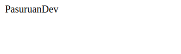
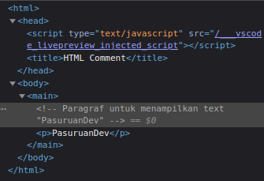

# HTML Comment

Comment biasanya berfungsi sebagai catatan kecil yang menjelaskan kode yang kita tulis. Comment akan diabaikan dan tidak dibaca oleh komputer saat programnya dijalankan atau di running.

HTML comment diawali dengan ```<!--``` dan diakhiri dengan ```-->```.

**Sebagai contoh :**

```HTML
<html>
  <head>
    <title>HTML Comment</title>
  </head>
  <body>
    <main>
      <!-- Paragraf untuk menampilkan text "PasuruanDev" -->
      <p>PasuruanDev</p>
    </main>
  </body>
</html>
```

Jika dijalankan, hasilnya akan terlihat seperti ini di browser:



Namun, dibelakang layar comment kita akan tetap terlihat pada source code



Bukan hanya sebagai catatan kecil saja, comment biasanya juga berguna untuk menghilangkan sebuah element untuk sementara yang kemungkinan akan kita tampilkan lagi nantinya. Daripada kita menghapusnya, lebih baik jika kita manfaatkan saja comment ini.

**Contohnya seperti :**

```HTML
<!DOCTYPE html>
<html>
  <head>
    <title>HTML Commnet</title>
  </head>
  <body>
    <!-- <h1>Hello World!<h1>  -->
    <p> Halo semua... Selamat Datang di PasuruanDev!</p>
  </body>
</html>
```

Pada code editor seperti VSCode biasanya terdapat shortcut untuk mempercepat penggunaan comment dengan menggunakan ```ctrl + /``` pada baris yang akan di comment